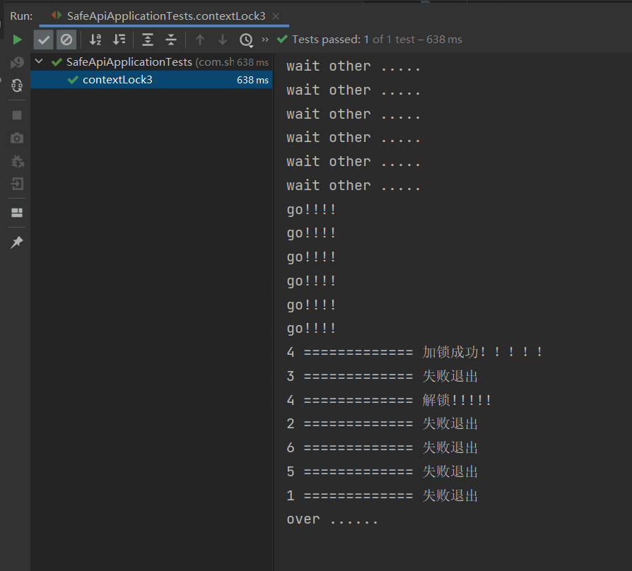
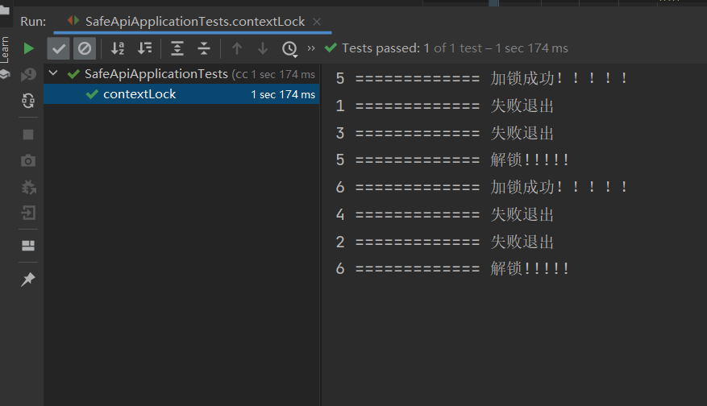

# redis分布式锁

### 分布式锁需满足四个条件

首先，为了确保分布式锁可用，我们至少要确保锁的实现同时满足以下四个条件：

1. 互斥性。在任意时刻，只有一个客户端能持有锁。
2. 不会发生死锁。即使有一个客户端在持有锁的期间崩溃而没有主动解锁，也能保证后续其他客户端能加锁。
3. 解铃还须系铃人。加锁和解锁必须是同一个客户端，客户端自己不能把别人加的锁给解了，即不能误解锁。
4. 具有容错性。只要大多数Redis节点正常运行，客户端就能够获取和释放锁。

## 实验结果

### 6个线程同时抢一把锁




### 6个线程，奇数线程先抢锁，偶数线程后抢锁



```java
RunWith(SpringRunner.class)
@SpringBootTest
public class SafeApiApplicationTests {
    @Autowired
    private RedisTemplate redisTemplate;
    @Autowired
    private RedissonClient redissonClient;


    /**
     * 6个线程
     * 奇数同时抢一把锁然后，睡眠一秒偶数同时抢一把锁
     * @throws InterruptedException
     */
    @Test
    public void contextLock() throws InterruptedException{
        CountDownLatch c = new CountDownLatch(6);
        //控制奇数线程并发
        CyclicBarrier c1 = new CyclicBarrier(3);
        //控制偶数线程并发
        CyclicBarrier c2 = new CyclicBarrier(3);
        IntStream.range(1, 7).forEach(i-> new Thread(()->{
            try {
                if (i % 2 == 0) {
                    Thread.sleep(1000);
                }
                if (i % 2 == 0) {
                    c2.await();
                    contextLoads(i);
                }else {
                    c1.await();
                    contextLoads(i);
                }
            } catch (InterruptedException | BrokenBarrierException e) {
                e.printStackTrace();
            }
            c.countDown();
        }).start());
        c.await();
    }

    @Test
    public void contextLock3() throws InterruptedException{
        //控制主线程等待
        CountDownLatch c = new CountDownLatch(6);
        //控制所有线程同时start();
        CyclicBarrier c2 = new CyclicBarrier(6);
       IntStream.range(1,7).forEach(i->{ new Thread(()->{
               try {
                   System.out.println("wait other .....");
                   Thread.sleep(500);
                   c2.await();
                   System.out.println("go!!!!");
                   contextLoads(i);
                   c.countDown();
               } catch (InterruptedException | BrokenBarrierException e) {
                   e.printStackTrace();
               }
           }).start();
       });
       c.await();
        System.out.println("over ......");
    }


    public void contextLoads(int i) throws InterruptedException {
        RLock hello = redissonClient.getLock("hello1");
        if (hello.tryLock(0, 10, TimeUnit.SECONDS)) {
            try {
                System.out.println(i+" ============="+" 加锁成功！！！！！");
            } catch (Exception e) {
                e.printStackTrace();
            }finally {
                hello.unlock();
                System.out.println(i+" ============="+" 解锁!!!!!");
            }
        }else {
            System.out.println(i+" ============="+" 失败退出");
        }
    }

}
```

